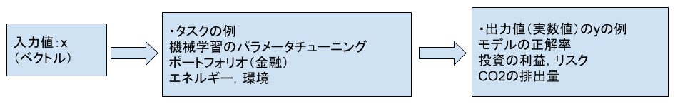
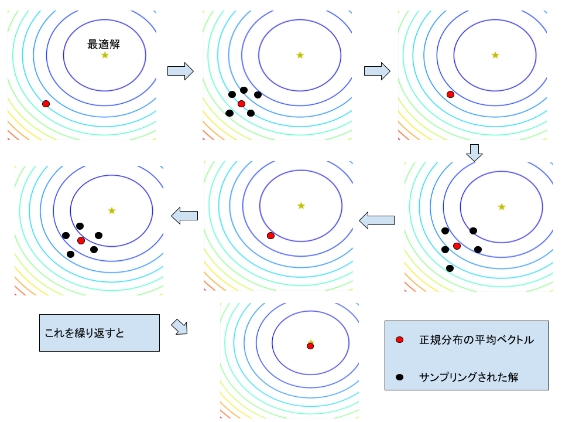

### 数理最適化：CMA-ESとは ~実装と挙動確認
CMA-ES(共分散行列適応進化戦略)は有力な数理最適化手法の一種であり，Nikolaus Hansenにより開発された手法である．
現在でも，応用，改良が日々，研究されている．

ソースコードはOptimizationフォルダ内のCMAES.pyとbenchmarks.pyです．

#### メリット
1. 入力値と出力値を得ることが出来れば，適用できる．
2. パラメータの更新に勾配を利用しないため，勾配の計算が難しいタスクにも適用できる．

#### デメリット
1. ハイパーパラメータが多い．
2. サンプリングされる解の数のチューニングが難しい．
(タスクにより，必要なサンプルサイズが大きく異なる．)

筆者が土日，あまりにも暇だったので，暇潰しとPythonの練習のつもりで実装してみました．
(CMA-ESの存在は学生のときに存じ上げており，多少の興味はありました．実装が合ってるのか少し不安ですが，アルゴリズムの挙動を見る限り，恐らく大丈夫だと思います．)
####  目次
##### 数理最適化とは
##### CMA-ESの挙動のイメージ
##### 用いるベンチマーク関数
##### ベンチマーク関数における最適化の様子
##### 30次元における最適化の挙動確認
##### コードの利用方法
##### 実装の所感と参考文献
-------------------------------------------------------
#### 数理最適化とは
数理最適化とは下記の図にように，タスクを通じて得られる出力値 $y\in\mathbb{R}$ が最小，または最大になるような入力値  $x\in\mathbb{R}^n$ を求めることが目的である．

#### CMA-ESの挙動のイメージ
下記の図はCMA-ESによる最適解探索の挙動の概要を表している．\
赤丸は正規分布の中心，星マークは最適解，黒丸はサンプリングされる解を表している．\
最適化のイメージを下記の図を元に説明する．
1. はじめに探索空間上に，正規分布の中心(赤点)を初期化する．
2. 次に，解(黒点)をサンプリングする．
3. 最後に，より最適解の値に近い解がより多くサンプリングされるように各パラメータを更新する．

これらの1. ~ 3. の操作を繰り返すことで最適解(星マーク)を探索する．

#### 用いるベンチマーク関数
ベンチマーク関数(問題)とはアルゴリズムの性能，挙動を確認するために用いられる最適解，関数景観が既知の問題クラスである．
> — 参考ページ: [ベンチマーク関数まとめ](https://qiita.com/tomitomi3/items/d4318bf7afbc1c835dda)

今回はその中でもRosenbrock functionを用いる．
下記にその数式と2次元のヒートマップを示す．

##### 数式　(n次元)
$f(x) = \Sigma_{i = 1}^n (100(x_{i + 1} - x_i^2)^2 + (x_i - 1.0)^2)$ $(x\in \mathbb{R}^n)$ \
次元…変数の数\
最適解 $[1.0, 1.0, ...,1.0]$, 評価値 $0.0$

##### 関数景観(2次元ヒートマップ)
下記に2次元のヒートマップを示す．
寒色の部分に行くほどが最適解に近い．

#### ベンチマーク関数における最適化の様子
下記にCMA-ESでRosenbrock function $(2$次元$)$を最適化する際の挙動を下記のGIFにて示す．

白点：正規分布の中心\
黒点：サンプリングされる解\
最適解： $[1.0, 1.0]$

#### 30次元における最適化の挙動確認
ここでは $30$ 次元Rosenbrock functionにおける最適化の挙動を確認する．
初期のパラメータは下記の通りとした．
平均ベクトル $m = [3.0, 3.0, ...,3.0]^{30}$, ステップサイズ $\sigma = 3.0$, 
サンプルサイズ $\lambda = 4 + \lfloor ln(30) \rfloor$

具体的に，下記の値を確認する．なお，ステップサイズ $\sigma$ ，評価値のグラフの縦軸は，ログスケールに設定している．

1. CMA-ESの平均ベクトル $m\in \mathbb{R}^{30}$
2. CMA-ESのステップサイズ $\sigma\in\mathbb{R}$ (正規分布の広がりを制御するパラメータ)
3. 探索途中の各世代における最良の評価値

##### 平均ベクトル
下記グラフより平均ベクトルが最適解 $[1.0, 1.0, ... ,1.0]\in \mathbb{R}^{30}$ に収束していることが分かる．

##### ステップサイズ
下記グラフより，ステップサイズ $\sigma$ が小さな値に収束していることが分かる． $\rightarrow$  正規分布の収束

##### 評価値
下記グラフより世代を重ねるにつれて最適解の評価値 $0.0$ に近づいていることが分かる．

#### コードの利用方法
CMAES.pyの上部がCMA-ESの実装，下部が実際の探索部分のコードとなっています．

また，ベンチマーク関数はbenchmarks.pyに実装しており，こちらから適宜，importする形となっております．

コードに関しては，numpy, mathモジュールしか使用していないので，ほとんどの環境で動くと思います．

#### 実装の所感と参考文献

ベンチマーク関数がきちんと最適化出来たときは，少し安心しました．（バグ取りが意外と大変だった．）\
また，実装に際しては，下記の2つの文献を参考にしました．\
参考文献1(主にp28~)を基本的に読みつつ，心配な部分を日本語の参考文献2で確認する形で実装を進めました．

1. Nikolaus Hansen, The CMA Evolution Strategy: A Tutorial. 2023. [PDF](./contents/参考文献1.pdf)

2. 清水洸希† 小宮山純平†† 豊田正史††, 高次元悪条件最適化問題のための確率的次元選択CMA-ES. DEIM Forum , 2019. [PDF](./contents/参考文献2.pdf)
